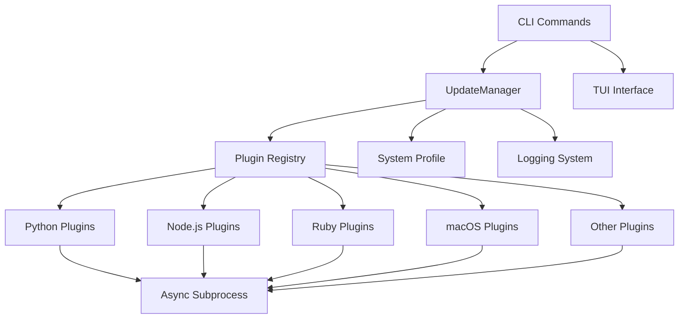

<div align="center">

# 🔄 updt

**Universal Package Dependency Tracker and Updater**

[](https://www.python.org)
[](LICENSE)
[](https://github.com/wyattowalsh/updt/actions)
[](https://codecov.io/gh/wyattowalsh/updt)
[](https://github.com/astral-sh/ruff)

[Features](#-features) • [Installation](#-installation) • [Quick Start](#-quick-start) • [Plugins](#-supported-package-managers) • [Documentation](#-documentation) • [Contributing](#-contributing)

</div>

---

## 📋 Overview

**updt** is a powerful, unified CLI tool that detects and updates dependencies across **16 package managers** and **multiple ecosystems**. Say goodbye to juggling different update commands—`updt` handles them all with a single, intuitive interface.

```bash
# Check for updates across ALL your package managers
updt check

# Update everything with one command
updt update

# Or use the beautiful interactive TUI
updt tui
```

> [!NOTE]
> **updt** supports Python, Node.js, Ruby, Rust, macOS, and more—all through an extensible plugin architecture.

---

## ✨ Features

<table>
<tr>
<td width="50%">

### 🎯 Core Capabilities

- 🔄 **16 Package Managers** — Unified interface for brew, npm, pip, cargo, and more
- ⚡ **Async Operations** — Fast concurrent update checking and execution
- 🎨 **Rich CLI & TUI** — Beautiful terminal output with interactive mode
- 📊 **System Profiling** — Generate reports of installed packages
- 🔧 **Highly Configurable** — via `pyproject.toml`, `.env`, or environment variables

</td>
<td width="50%">

### 🛠️ Developer Features

- 🔌 **Plugin Architecture** — Extensible system for new package managers
- 📝 **Structured Logging** — JSONL format for easy parsing
- 🧪 **Dry-Run Mode** — Preview changes before applying
- 🔢 **Version Managers** — Support for nvm, rvm, pyenv
- 📚 **Comprehensive Docs** — Full Sphinx documentation with Shibuya theme

</td>
</tr>
</table>

---

## 🚀 Installation

<details open>
<summary><b>Recommended: Using uvx (fastest)</b></summary>

```bash
uvx updt
```

Run directly without installation!

</details>

<details>
<summary><b>Using uv tool install</b></summary>

```bash
uv tool install updt
```

Installs updt in an isolated environment.

</details>

<details>
<summary><b>Using pip</b></summary>

```bash
pip install updt
```

Traditional pip installation.

</details>

<details>
<summary><b>From source</b></summary>

```bash
git clone https://github.com/wyattowalsh/updt.git
cd updt
uv sync --all-extras
uv run updt --help
```

For development or latest changes.

</details>

---

## 🎬 Quick Start

### Basic Commands

```bash
# Check for updates across all package managers
updt check

# Check updates for a specific project
updt check --project /path/to/project

# Update all packages
updt update

# Preview updates without applying (dry-run)
updt update --dry-run

# Launch interactive TUI
updt tui

# List available plugins
updt list-plugins

# Show current configuration
updt config --show

# Generate system profile
updt profile

# Export profile to file
updt profile --output packages.json
updt profile --output packages.md --format markdown
```

### Example Output

```console
$ updt check
⠋ Checking for updates...

┏━━━━━━━━━━━┳━━━━━━━━━━━━━━┳━━━━━━━━━━━━━━━┳━━━━━━━━━━━━━┳━━━━━━━━┓
┃ Ecosystem ┃ Package      ┃ Current       ┃ Latest      ┃ Scope  ┃
┡━━━━━━━━━━━╇━━━━━━━━━━━━━━╇━━━━━━━━━━━━━━━╇━━━━━━━━━━━━━╇━━━━━━━━┩
│ npm       │ typescript   │ 5.2.2         │ 5.3.3       │ global │
│ brew      │ python@3.12  │ 3.12.0        │ 3.12.1      │ global │
│ pip       │ requests     │ 2.31.0        │ 2.32.0      │ global │
└───────────┴──────────────┴───────────────┴─────────────┴────────┘

Found 3 updates across 3 ecosystems
```

---

## 🔌 Supported Package Managers

**updt** currently supports **16 package managers** across multiple ecosystems:

### Python Ecosystem (6 plugins)

| Plugin | Description | Status |
|--------|-------------|--------|
| **uv** | Modern Python package manager | ✅ |
| **pip** | Python package installer | ✅ |
| **pipx** | Isolated Python applications | ✅ |
| **conda** | Environment & dependency manager | ✅ |
| **poetry** | Python dependency management | ✅ |
| **pyenv** | Python version manager | ✅ |

### Node.js Ecosystem (4 plugins)

| Plugin | Description | Status |
|--------|-------------|--------|
| **npm** | Node.js package manager | ✅ |
| **yarn** | Fast, reliable package manager | ✅ |
| **pnpm** | Disk-efficient package manager | ✅ |
| **nvm** | Node.js version manager | ✅ |

### Ruby Ecosystem (3 plugins)

| Plugin | Description | Status |
|--------|-------------|--------|
| **gem** | RubyGems package manager | ✅ |
| **bundler** | Ruby dependency manager | ✅ |
| **rvm** | Ruby version manager | ✅ |

### macOS Ecosystem (2 plugins)

| Plugin | Description | Status |
|--------|-------------|--------|
| **brew** | Homebrew (formulae + casks) | ✅ |
| **mas** | Mac App Store CLI | ✅ |

### Other Languages (1 plugin)

| Plugin | Description | Status |
|--------|-------------|--------|
| **cargo** | Rust package manager | ✅ |

> [!TIP]
> Need support for another package manager? [Request a plugin](https://github.com/wyattowalsh/updt/issues/new/choose) or [contribute one](#-contributing)!

---

## ⚙️ Configuration

Configure **updt** via `pyproject.toml`, environment variables, or `.env` files:

<details>
<summary><b>pyproject.toml configuration</b></summary>

```toml
[tool.updt]
log_level = "INFO"
log_format = "jsonl"  # or "text"
default_mode = "plan"
dry_run = false
max_concurrent_updates = 5
timeout = 300  # seconds

[tool.updt.ecosystems]
brew = true
bundler = true
cargo = true
conda = true
gem = true
mas = true
npm = true
nvm = true
pip = true
pipx = true
pnpm = true
poetry = true
pyenv = true
rvm = true
uv = true
yarn = true
```

</details>

<details>
<summary><b>Environment variables</b></summary>

All configuration keys can be set via environment variables with `UPDT_` prefix:

```bash
export UPDT_LOG_LEVEL=DEBUG
export UPDT_DRY_RUN=true
export UPDT_MAX_CONCURRENT_UPDATES=10
export UPDT_ECOSYSTEMS__BREW=true
export UPDT_ECOSYSTEMS__NPM=false
```

</details>

<details>
<summary><b>.env file</b></summary>

Create a `.env` file in your project root:

```env
UPDT_LOG_LEVEL=DEBUG
UPDT_LOG_FORMAT=jsonl
UPDT_DRY_RUN=false
UPDT_MAX_CONCURRENT_UPDATES=5
UPDT_TIMEOUT=300
```

</details>

---

## 🏗️ Architecture



**Key Components:**

- **CLI**: Built with Typer for command-line interface
- **TUI**: Interactive terminal UI with Textual
- **Config**: Pydantic v2 models with pydantic-settings
- **Logging**: Structured logging with Loguru
- **Plugins**: Modular plugin system for package managers
- **Async**: Async/await for concurrent operations
- **Profiling**: System-wide package inventory generation

---

## 📚 Documentation

Comprehensive documentation is available:

- 📖 [**Full Documentation**](https://wyattowalsh.github.io/updt/) — Sphinx docs with Shibuya theme
- 🚀 [**Quick Start Guide**](docs/source/guides/quickstart.md) — Get started in minutes
- 🔧 [**Configuration Guide**](docs/source/guides/configuration.md) — Advanced configuration
- 🔌 [**Plugin Development**](docs/source/guides/plugins.md) — Create custom plugins
- 📊 [**System Profiling**](docs/source/guides/profile.md) — Generate package reports
- 🤖 [**AGENTS.md**](AGENTS.md) — LLM development guide

### Building Documentation Locally

```bash
cd docs
uv run sphinx-build -b html source _build/html
# Open _build/html/index.html in your browser
```

---

## 🧪 Development

### Setup Development Environment

```bash
# Clone the repository
git clone https://github.com/wyattowalsh/updt.git
cd updt

# Install dependencies with all extras
uv sync --all-extras

# Run tests
uv run pytest -v

# Run linter
uv run ruff check .

# Format code
uv run ruff format .

# Run type checker
uv run mypy src/
```

### Running Tests

```bash
# Run all tests
uv run pytest

# Run with coverage
uv run pytest --cov=src/updt --cov-report=html

# Run specific test file
uv run pytest tests/test_plugins.py

# Run with verbose output
uv run pytest -v -s
```

### Project Structure

```
updt/
├── src/updt/               # Source code
│   ├── cli.py             # Typer CLI commands
│   ├── updater.py         # Core UpdateManager
│   ├── profile.py         # System profiling
│   ├── logging.py         # Loguru setup
│   ├── models/            # Pydantic data models
│   │   ├── config.py      # Configuration models
│   │   └── update.py      # Update info/result models
│   ├── plugins/           # Package manager plugins (16 total)
│   │   ├── base.py        # PluginBase abstract class
│   │   ├── registry.py    # Plugin registry
│   │   ├── brew.py        # Homebrew
│   │   ├── npm.py         # Node.js
│   │   ├── pip.py         # Python
│   │   └── ...            # 13 more plugins
│   └── tui/               # Textual TUI
│       └── app.py         # TUI application
├── tests/                  # Test suite
├── docs/                   # Sphinx documentation
├── pyproject.toml          # Project configuration
└── AGENTS.md               # LLM development guide
```

---

## 🤝 Contributing

Contributions are welcome! Whether it's bug reports, feature requests, documentation improvements, or new plugins—we'd love your help.

### Ways to Contribute

1. 🐛 [**Report bugs**](https://github.com/wyattowalsh/updt/issues/new/choose)
2. ✨ [**Request features**](https://github.com/wyattowalsh/updt/issues/new/choose)
3. 🔌 [**Request plugins**](https://github.com/wyattowalsh/updt/issues/new/choose)
4. 💻 **Submit pull requests**
5. 📝 **Improve documentation**

### Development Guidelines

- Follow [PEP 8](https://peps.python.org/pep-0008/) style guide
- Use type hints throughout
- Keep lines under 100 characters
- Write tests for new features
- Update documentation and AGENTS.md
- Run `ruff check .` before committing

### Adding a New Plugin

See the [**Plugin Development Guide**](docs/source/guides/plugins.md) or [**AGENTS.md**](AGENTS.md) for detailed instructions.

Quick steps:
1. Create `src/updt/plugins/mypkg.py`
2. Inherit from `PluginBase`
3. Implement required methods
4. Register plugin
5. Add to configuration
6. Write tests
7. Update documentation

---

## 📝 License

This project is licensed under the **MIT License** - see the [LICENSE](LICENSE) file for details.

---

## 🙏 Acknowledgments

Built with these amazing tools:

- [Typer](https://typer.tiangolo.com/) — CLI framework
- [Textual](https://textual.textualize.io/) — TUI framework
- [Rich](https://rich.readthedocs.io/) — Terminal styling
- [Pydantic](https://docs.pydantic.dev/) — Data validation
- [Loguru](https://loguru.readthedocs.io/) — Logging
- [uv](https://docs.astral.sh/uv/) — Python packaging

---

## 📊 Stats


---

<div align="center">

Made with ❤️ by [wyattowalsh](https://github.com/wyattowalsh)

[⬆ Back to Top](#-updt)

</div>
